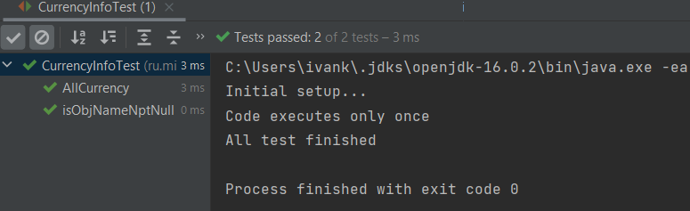

# **Отчет по проведенному Unit тестированию класса CurrencyInfo в task30**

* Все тесты пройдены
  * @Test AllCurrency 3ms
  * @Test isObjNameNptNull 0ms
  
***Вывод:*** в ходе данной работы я научился создавать и оформлять .md файлы
  